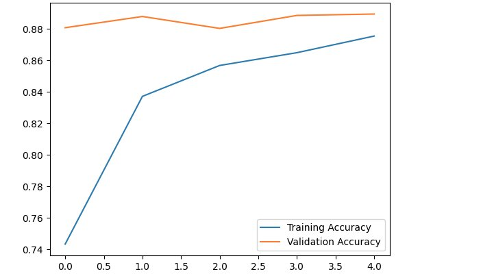
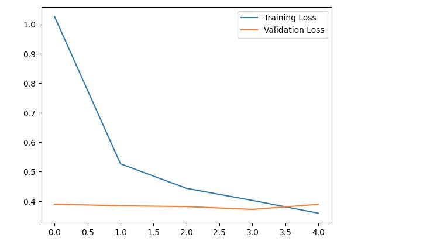
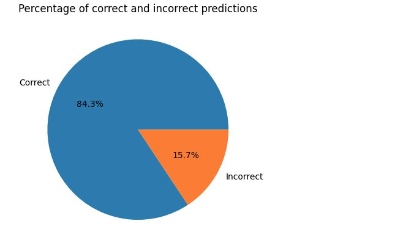

# Animal detection model
> A model to automatically identify and classify animals in images. It is trained on the Animals Detection Images Dataset from [Kaggle](https://www.kaggle.com/datasets/antoreepjana/animals-detection-images-dataset). **It relies on the pre-trained weights of EfficientNet B7.**

## Results on Kaggle
The notebook on Kaggle can be viewed on [https://www.kaggle.com/code/richardodhiambo/animal-detection-model](https://www.kaggle.com/code/richardodhiambo/animal-detection-model)

## Dependencies versions
1. Tensorflow - 2.14.0
2. Numpy - 1.23.5
3. Pandas - 1.5.3

## Impelemntation

Transfer learning from pre-trained weights of **EfficientNet B7**

## Credits

- [https://towardsdatascience.com/the-w3h-of-alexnet-vggnet-resnet-and-inception-7baaaecccc96](https://towardsdatascience.com/the-w3h-of-alexnet-vggnet-resnet-and-inception-7baaaecccc96)
- [https://medium.com/@enrico.randellini/image-classification-resnet-vs-efficientnet-vs-efficientnet-v2-vs-compact-convolutional-c205838bbf49](https://medium.com/@enrico.randellini/image-classification-resnet-vs-efficientnet-vs-efficientnet-v2-vs-compact-convolutional-c205838bbf49)
- [https://keras.io/examples/vision/image_classification_efficientnet_fine_tuning/](https://keras.io/examples/vision/image_classification_efficientnet_fine_tuning/)
- [https://theaisummer.com/cnn-architectures/](https://theaisummer.com/cnn-architectures/)

## License

This project is licensed under the [MIT License](LICENSE).
