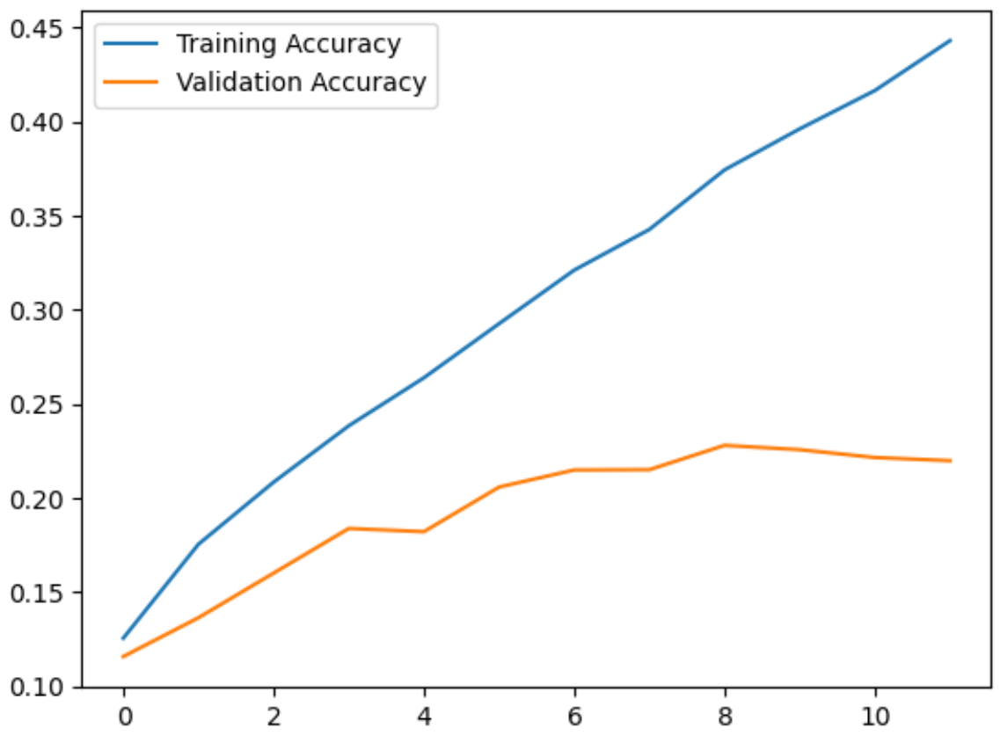
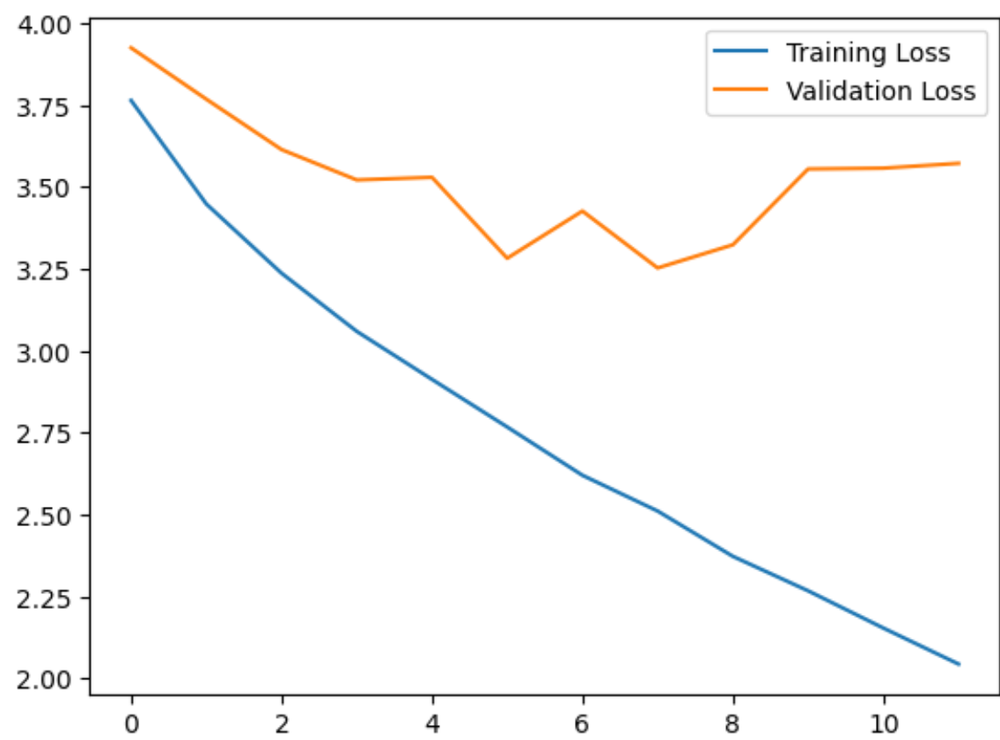

# Animal detection model
> A model to automatically identify and classify animals in images trained on the Animals Detection Images Dataset from Kaggle (https://www.kaggle.com/datasets/antoreepjana/animals-detection-images-dataset)

# Current Validation Accuracy: Around 22%. Any insight on improvement is welcomed.

A similar implementation is in Kaggle ([Animal Detection Model](https://www.kaggle.com/code/richardodhiambo/animal-detection-model))

## Requirements  (Prerequisites)
* Python 3.10 and up [Install](https://www.python.org/downloads/)
* Jupyter Notebook (You can run it various locations: Locally, Google Colab or Kaggle)

## Project Outline
The repository contains several folders and files:
* .vscode - Contains Vistual Studio Code settings.
* screenshots - Contains several screenshots for the program.
* complete_animal-detection-model - COntains the architecture, weights, and optimizer state.
* model.ipynb - Contains a Jupyter Notebook showing my implementation of the model.
* weights_animal_detection_model.h5 - Contains the weights of the model.

## Installation
Clone this repository to your local machine.

## How to Contribute

For major changes, please open an issue first to discuss what you would like to change. If you'd like to contribute, please fork the repository and make changes as you'd like. Pull requests are warmly welcome.

Steps to contribute:
1. Fork this repository
2. Create your feature branch
3. Commit your changes
4. Push to the branch
5. Create a new Pull Request

# Authors

The author of this project is Richard Odhiambo.

 You can find me here at:
[Github](https://github.com/o-richard)

# Credits

Here's a list of related blogs which helped me in creating the best possible version of my project:
* [https://www.tensorflow.org/tutorials/images/classification](https://www.tensorflow.org/tutorials/images/classification)
* [https://www.geeksforgeeks.org/python-image-classification-using-keras/](https://www.geeksforgeeks.org/python-image-classification-using-keras/)
* [https://towardsdatascience.com/image-detection-from-scratch-in-keras-f314872006c9](https://towardsdatascience.com/image-detection-from-scratch-in-keras-f314872006c9)
* [https://makeschool.org/mediabook/oa/tutorials/keras-for-image-classification-pfw/checking-for-accuracy/](https://makeschool.org/mediabook/oa/tutorials/keras-for-image-classification-pfw/checking-for-accuracy/)

# License

This project is licensed under the [MIT License](LICENSE).
